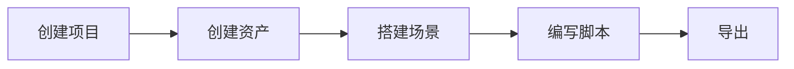

**Oasishub Engine** 是一套 Web 为先、移动优先、开源共建的实时互动解决方案，采用组件化架构并用 [Typescript](https://www.typescriptlang.org/) 编写。它包含[渲染](/docs/graphics/renderer/renderer)、[物理](/docs/physics/overall)、[动画](/docs/animation/overview)、[交互](/docs/input/input)、[XR](/docs/xr/overall)等功能，并提供了具备完善工作流的可视化在线编辑器，帮助你在浏览器上创作绚丽的 2D/3D 互动应用。它主要由两部分组成：

- 编辑器：一个在线 Web 互动创作平台 Editor
- 运行时：一个 Web 为先、移动优先的高性能的互动运行时 Runtime，丰富的非核心功能和偏业务逻辑定制功能 Toolkit, 以及一系列二方生态包。

## 编辑器

Oasishub Editor 是一个在线 Web 互动创作平台。它可以帮助你快速地创建、编辑和导出一个互动项目。你可以通过 Oasishub Editor 快速上传资产，编辑材质、调整灯光、创建实体，从而创造出复杂的场景。

使用编辑器创建互动项目的整体流程：



通过编辑器可以让技术与美术同学更好地进行协作，你可以在编辑器首页通过业务模板快速开始第一个项目的开发。

## 运行时

核心功能由 Oasishub Runtime 提供，非核心和偏业务逻辑定制的高级功能由 Oasishub Toolkit 提供。你可以通过浏览器在线浏览引擎的各种[示例](/examples/background)。

### 核心包

包括以下子包：

| 包 | 解释 | 相关文档 |
| :-- | :-- | --- |
| @oasishub/engine | 核心架构逻辑和核心功能 | API |
| @oasishub/engine-physics-lite | 轻量级物理引擎 | [Doc](/docs/physics/overall) |
| @oasishub/engine-physics-physx | 全功能物理引擎 | [Doc](/docs/physics/overall) |
| @oasishub/engine-shaderlab | Oasishub Shader 编译器 | [Doc](/docs/graphics/material/shader) |
| @oasishub/engine-xr | XR 逻辑包 | [Doc](/docs/xr/overall) |
| @oasishub/engine-xr-webxr | WebXR 后端 | [Doc](/docs/xr/overall) |
| @oasishub/engine-ui | UI | [Doc](/docs/UI/overall) |

你可以通过 [NPM](https://docs.npmjs.com/) 的方式进行安装：

```bash
npm install --save @oasishub/engine
```

然后在业务中引入使用：

```typescript
import { WebGLEngine, Camera } from "@oasishub/engine";
```

### 工具包

非核心功能和偏业务逻辑定制功能由 oasishub-toolkit 包提供（完成功能列表请查看engine-toolkit）：

| 包 | 解释 | API |
| :-- | :-- | :-- |
| @oasishub/engine-toolkit-controls | 控制器 | [Doc](/docs/graphics/camera/control/) |
| @oasishub/engine-toolkit-framebuffer-picker | 帧缓冲拾取 | [Doc](/docs/input/framebuffer-picker/) |
| @oasishub/engine-toolkit-stats | 引擎统计面板 | [Doc](/docs/performance/stats/) |
| ...... |  |  |

> 在同一项目中，请保证引擎核心包的版本一致和工具包的大版本保持一致，以 1.3.x 版本的引擎为例，需要配套使用 1.3.y 版本的工具包。

### 二方生态包

另外还有一些二方生态包，引入和使用方式和引擎工具包相同：

| 包 | 解释 | API |
| :-- | :-- | :-- |
| @oasishub/engine-spine | Spine 动画 | [Doc](/docs/graphics/2D/spine/overview/) |
| @oasishub/engine-lottie | Lottie 动画 | [Doc](/docs/graphics/2D/lottie/) |

> 二方生态包的版本依赖关系，请参照对应文档说明。

> [点击深入了解 Oasishub 的版本管理](/docs/basics/version/)

## 兼容性

Oasishub Runtime 在支持 WebGL 的环境下运行，到目前为止，所有主流的移动端浏览器与桌面浏览器都支持这一标准。可以在 [CanIUse](https://caniuse.com/?search=webgl) 上检测运行环境的兼容性。

对于一些需要额外考虑兼容性的功能模块，当前的适配方案如下：

| 模块 | 兼容考虑 | 具体文档 |
| :-- | :-- | :-- |
| [鼠标与触控](/docs/input/input/) | [PointerEvent](https://caniuse.com/?search=PointerEvent) | 兼容请参照 polyfill-pointer-event |
| [PhysX](/docs/physics/overall) | [WebAssembly](https://caniuse.com/?search=wasm) | 在不支持 WebAssembly 的情况下，会降级为 JS 版本，略低于 WebAssembly 版本的性能与表现 |

## 开源共建

**Oasishub** 渴望与你共建互动引擎，所有的开发流程，包括规划，里程碑，架构设计在内的信息，全部都公开在 GitHub 的项目管理中，你可以通过[创建 issue](https://docs.github.com/zh/issues/tracking-your-work-with-issues/creating-an-issue) 与[提交 PR](https://docs.github.com/zh/pull-requests/collaborating-with-pull-requests/proposing-changes-to-your-work-with-pull-requests/creating-a-pull-request-from-a-fork) 参与到引擎的建设当中。如果你有疑问或者需要帮助，可以加入钉钉群或讨论区寻求帮助。
